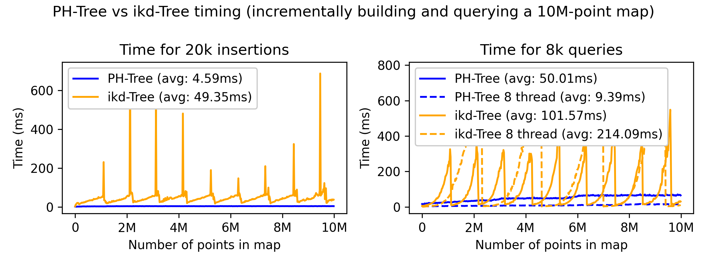

# Spatial index benchmarking


In this repo, we benchmark spatial indexes that fulfill large-scale lidar-based state-estimation requirements, which are the ability to add or remove points without rebuilding the index from scratch, allowing k-nearest-neighbour and radius searches, and scalability with over 10 million points in the index.
We use two data structures with publicly available C++ implementations: ikd-Trees \[1\] and PH-Trees \[2\].
__EDIT JAN 2026__: Added i-Octree \[3\] to the benchmark. Quite promising results!

Our toy example emulates a driving scenario with an incrementally built lidar map of 10 million points created along a 5km trajectory.
We simulate the lidar collection with `scans' of 20k points at random locations within the lidar range (100m).
Every time a scan is inserted in the spatial index, 8k nearest-neighbour queries are performed to imitate the registration process.
Dividing the goal of 10 million points in the final map by the size of the scans, we obtain 500 steps of 10m each.
The trajectory is defined as a straight line parameterized by x=y and z=0.

Below are the computation times obtained with an ikd-Tree, a PH-Tree, and an i-Octree.





Extra notes:
- After reading some issues on the ikd-Tree repo, it is advised to let the tree settle after insertion. I put a 50ms sleep that is not included in the graphs (but looking at the query graph, it does not seem sufficient...). PH-Trees are free from that constraint.
- Not sure what I am doing wrong, but putting a simple OMP pragma around the query loop has a negative impact on the average ikd-Tree query time (PH-Tree and i-Octree show a clear speed-up).
- In that benchmark, the PH-Tree and i-Octree use `double` (the default i-Octree `float` implementation has been modified to use `double`), whereas the ikd-Tree implementation uses `float` (a bit slower when changed to `double`). It could matter for long maps or when the map is anchored in a faraway reference frame (the 6 to 9 decimals of float could round point values).

Overall, the Ph-Tree has the best insertion time (with per point insertion, while the other methods work best with batch insertion: with per-point insertion i-Octree is ~3x slower), but the i-Octree has the best query time.


## Test by yourself

Tested only with Ubuntu 24.04

### Dependencies

Eigen3
```
sudo apt install libeigen3-dev
```

PCL (for ikd-Tree)
```
sudo apt install libpcl-dev
```

### Build

```
mkdir build
cd build
cmake ..
make
```

### Run

```
./spatial_index_benchmark
```

To select which algorithm to use and to enable/disable multi-threading, modify the different `#define` at the top of `app/spatial_index_benchmark.cpp`. It's not convenient, but I wanted to make sure the methods were run alone to avoid unexpected side effects.

Then you have a script to generate the figure above.
```
python scripts/plot_timing.py
```
(numpy and matplotlib as dependencies)


## References
[1] Cai, Y., Xu, W., & Zhang, F. (2021). ikd-tree: An incremental kd tree for robotic applications. arXiv preprint arXiv:2102.10808. [Code](https://github.com/hku-mars/ikd-Tree)

[2] Zäschke, T., Zimmerli, C., & Norrie, M. C. (2014, June). The ph-tree: a space-efficient storage structure and multi-dimensional index. In Proceedings of the 2014 ACM SIGMOD international conference on Management of data (pp. 397-408). [Code](https://github.com/tzaeschke/phtree-cpp)

[3] J. Zhu, H. Li, Z. Wang, S. Wang and T. Zhang (2024), i-Octree: A Fast, Lightweight, and Dynamic Octree for Proximity Search. In Proceedings of the 2024 IEEE International Conference on Robotics and Automation (ICRA). [Code](https://github.com/zhujun3753/i-octree)
